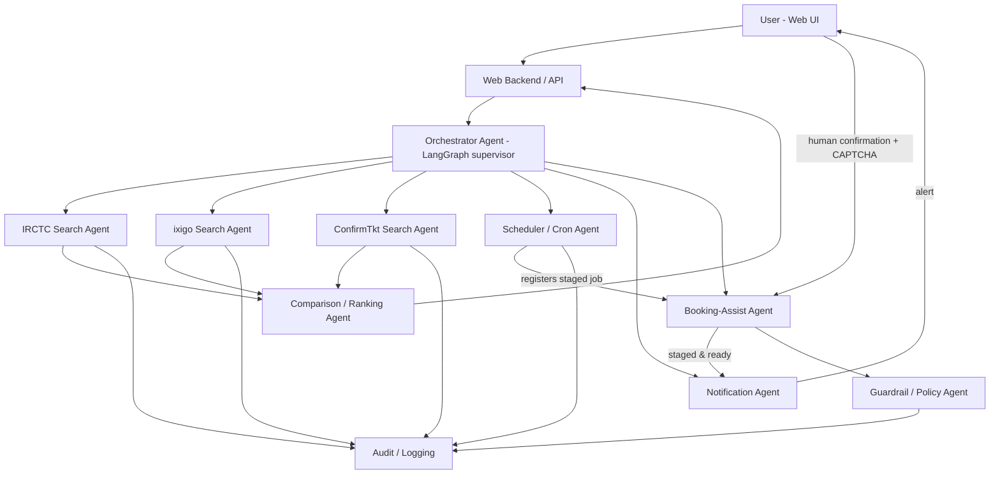

# Functional Requirements Document (FRD)
## Multi-Agent Train Ticket Search & Booking Assistant

| Field | Value |
|---|---|
| Author | Anmol |
| Status | v0.3 — FR-1..FR-11 built; FR-12..FR-15 added for the Launch Pad |
| Last updated | 2026-08-30 |
| Related doc | [PRD.md](./PRD.md), [AUTOMATION_LIMITS.md](./AUTOMATION_LIMITS.md) |

Read [PRD.md §2](./PRD.md) before this document — the human-confirmation gate on booking is a hard constraint on FR-7 below, not an implementation detail. [PRD.md §2a](./PRD.md) settles the recurring "let the agent browse the site" question; it is not reopened here.

---

## 1. System Architecture

## 2. Agent Roster & Responsibilities

| Agent | Responsibility | Notes |
|---|---|---|
| **Orchestrator Agent** | Receives the parsed journey request, dispatches to the right subagents, aggregates results, manages the overall LangGraph run (including pausing at the human-confirmation node) | LangGraph supervisor node |
| **IRCTC / ixigo / ConfirmTkt Search Agents** | One per platform. Adapter pattern: same input/output contract, platform-specific implementation inside. Read-only availability/fare search only. | Isolate platform-specific breakage; swap in official API client here if/when available |
| **Comparison / Ranking Agent** | Normalizes results from all search agents into one schema, ranks by price/availability/confidence/travel-time, produces a plain-language summary via Gemini 2.5 Flash | Pure function over already-fetched data — no external calls |
| **Scheduler / Cron Agent** | Registers and fires time-gated jobs (e.g. "stage this booking 2 minutes before the 10:00 IST Tatkal window") | APScheduler or Celery-beat; IST-aware; NTP-synced host clock |
| **Booking-Assist Agent** | Logs in, navigates to the booking page, pre-fills passenger/payment forms, stops at the human-confirmation gate, surfaces the CAPTCHA image/state to the user, and only proceeds to final submit on an explicit authenticated user action | Never auto-submits; never auto-solves CAPTCHA — see FR-7 |
| **Notification Agent** | Delivers alerts (window opening, staging complete, booking result) over the configured channel | Push / email / SMS / webhook — pluggable |
| **Guardrail / Policy Agent** | Runtime enforcement of PRD §2: intercepts every action the Booking-Assist Agent attempts to take and rejects any that would submit/pay without a fresh human-confirmation token | Not just a design-time rule — enforced in code, see FR-9 |
| **Audit / Logging Agent** | Immutable, timestamped log of every agent action, every human confirmation, every external request made | Source of truth for the "zero unattended submissions" success metric |

## 3. Functional Requirements

### FR-1 — Natural Language Journey Request
- User submits free text (e.g. "book AC 3-tier Delhi to Mumbai this Friday, Tatkal, 2 adults").
- Gemini 2.5 Flash parses this into a structured `JourneyRequest` (origin station code, destination station code, date, class, quota, passenger count, passenger details if already on file).
- The structured interpretation is **echoed back to the user for confirmation** before any search is dispatched (guards against misparsed dates/stations).

### FR-2 — Orchestrator Dispatch
- On confirmed `JourneyRequest`, Orchestrator fans out to all enabled platform Search Agents in parallel.
- Each Search Agent has a timeout (e.g. 8s); a slow/failed platform doesn't block the others — partial results are shown with a "platform X timed out" indicator.

### FR-3 — Platform Search Agents
- Common interface: `search(origin, destination, date, class, quota) -> List[TrainOption]`.
- `TrainOption` schema: train number/name, departure/arrival time, duration, class, quota, fare, availability status (confirmed/RAC/waitlist number), platform source.
- Read-only. No login-and-submit behavior lives in these agents (that's the Booking-Assist Agent's job, and only for the platform the user chooses to act on).
- Each platform's adapter is implemented against whatever legitimate access exists for that platform (official API if available; otherwise the platform's own public search page, respecting robots.txt/rate limits) — confirmed per-platform during the PRD's spike milestone.

### FR-4 — Comparison / Ranking Agent
- Merges `TrainOption` lists from all platforms, dedupes the same train/class appearing on multiple platforms, ranks by a configurable weighting (default: confirmed-availability first, then price, then duration).
- Produces a short natural-language summary via Gemini 2.5 Flash ("3AC on 12951 is waitlisted on IRCTC but showing 4 confirmed seats via ixigo at ₹X").

### FR-5 — Scheduler / Cron Agent
- User can attach a `ScheduledJob` to a journey request: target quota window (e.g. Tatkal AC opens 10:00 IST, non-AC 11:00 IST), lead time (how many minutes before the window to start staging).
- Job store is persistent (survives process restart) — not an in-memory timer.
- At `window_open_time - lead_time`, the job triggers the Booking-Assist Agent to begin staging (see FR-6).
- Idempotency: a job fires exactly once; retried/duplicate triggers are rejected by job ID.
- All times stored and computed in IST explicitly; host clock assumed NTP-synced (flagged as an ops requirement, not assumed silently).

### FR-6 — Booking-Assist Agent: Staging
- On trigger, logs into the target platform with the user's stored (encrypted) credentials.
- Navigates to the booking page for the selected `TrainOption`, fills passenger details, class, quota, and payment method selection.
- Stops immediately before the final submit/pay action.
- Reports status to the Orchestrator: `staged_and_waiting`.

### FR-7 — Booking-Assist Agent: Human-Confirmation Gate (hard constraint)
- The agent **must not** solve, bypass, or auto-fill any CAPTCHA challenge.
- The agent **must not** submit the final booking or payment step without a fresh, explicit confirmation action from the authenticated user (e.g. clicking "Confirm & Pay" in the web UI within an active session, at the moment the window is open).
- This requirement is enforced twice: once in the Booking-Assist Agent's own logic, and independently by the Guardrail/Policy Agent (FR-9), so a bug in one doesn't remove the protection.
- If official IRCTC Agent API credentials are configured for a given integration, this gate may be bypassed **only for that specific, licensed integration path** — implemented as an explicit, separately-flagged configuration, not a default.

### FR-8 — Notification Agent
- Sends an alert the moment a `ScheduledJob` reaches `staged_and_waiting`, and again if staging fails.
- Channel is pluggable (push/email/SMS/webhook/Telegram) — decided per PRD §13 open question.
- Notification includes a direct deep link into the web UI's confirmation screen.

### FR-9 — Guardrail / Policy Agent
- Sits between the Booking-Assist Agent and any external platform call that would mutate state (submit/pay).
- Requires a valid, time-bounded "human confirmation token" (issued only when the user takes the confirming action in an active browser session) attached to any such call; rejects and logs the attempt otherwise.
- Rate-limits login/search attempts per platform per time window to avoid tripping platform anti-abuse systems.
- Blocks any code path that would fan out the same booking across multiple accounts (bulk-booking pattern) — out of scope per PRD non-goals.

### FR-10 — Audit & Logging
- Every agent action (search call, login, form-fill, confirmation-token issuance, submit attempt, submit result) is written to an append-only audit log with timestamp, agent, and outcome.
- Audit log is queryable from the web UI (history view) and is the data source for the "zero unattended submissions" metric in the PRD.

### FR-11 — Web Interface
- **Journey request screen:** free-text input + structured confirmation (FR-1).
- **Comparison screen:** ranked results table/cards from FR-4, filter/sort controls.
- **Live agent status board:** per-request view showing each subagent's state (searching → done/failed; if scheduled: waiting → staging → staged_and_waiting → confirmed/failed).
- **Confirmation screen:** shows the pre-filled booking, the CAPTCHA challenge, and a "Confirm & Pay" action — this is the only screen that can issue a confirmation token.
- **History screen:** past requests, bookings, and audit log.
- **Saved profiles:** passenger details, frequent routes.
- Responsive/mobile-first (Tatkal windows are often handled on a phone).

### FR-12 — Booking Modes: Book Now vs. Scheduled

- Every `ScheduledJob` carries a `booking_mode` of `immediate` or `scheduled`.
- **`immediate`** (the common case, any non-Tatkal journey): created already `staged_and_waiting`, with no scheduler entry and no pre-window reminders, because there is no window to wait for. `POST /api/jobs/immediate`.
- **`scheduled`**: the existing FR-5 path, for timed quota windows only.
- Requiring a `window_open_time` for every booking — the pre-FR-12 behaviour — forced users to invent one for journeys that had none, and was the app's single biggest source of confusion.
- The internal confirm-token flow (FR-7) is not offered on `immediate` jobs: they never pass through mock staging, so the control would appear to confirm a real booking and would not.

### FR-13 — Booking Handoff Agent (the "Launch Pad")

`GET /api/jobs/{id}/handoff` returns everything needed at the window on one screen:

- **Countdown** to the window, anchored to server time (scheduled mode only).
- **Window sanity check** — the real Tatkal instant is computed from travel date and class (day before travel; 10:00 IST for AC classes, 11:00 for non-AC) and a mismatch against the scheduled time is returned as `window_warning`.
- **Selection spec** — station codes, date, train, class, quota, passenger count, expected fare — so nothing must be decided or looked up while the clock runs.
- **Passenger block** — paste-ready, with a shortfall count when fewer profiles exist than the journey needs.
- **Booking URL** — the real IRCTC search page. No prefill parameters: IRCTC publishes no documented deep-link format, and a guessed one would return 200 with a blank screen on their SPA, i.e. fail while looking like this app's bug. `build_booking_url()` is the single place to add one if a format is ever verified.

### FR-14 — Guided Prep Checklist

- Steps are a **sequence**, not a flat list. Exactly one is `current` — the first not yet done — and the UI expands it.
- Each step carries: instruction, rationale, an in-app **click path** where the destination has no linkable URL, **verified external links**, and contextual tips.
- `POST /api/jobs/{id}/checklist` toggles a step and returns the refreshed handoff, so the UI advances in one round trip.
- **Completed steps stay in the list with full content** and can be reopened; they are also never flagged overdue, since nagging about finished work is what makes people stop reading a checklist.
- Progress persists in `ScheduledJob.checklist_progress` (JSON, keyed by step → completion timestamp). It must survive a refresh, a browser restart, or a device change: a Tatkal prep run begins 30 minutes before the window.
- Scheduled-mode steps carry deadlines at T-30m (Master List), T-20m (eWallet), T-10m (login), T-2m (open page), T-0 (decline insurance). Immediate mode uses the same substance with no deadlines.
- The steps deliberately drive **IRCTC's own** speed features — Master List, eWallet, early login — which is ordinary user behaviour, not platform automation.

### FR-15 — Data Provenance & PNR Capture

- Every search adapter declares `is_live`. The orchestrator aggregates this into a `data_source` summary carried through to the UI, which **must** label a fare or availability figure as simulated wherever one is shown. Presenting a generated fare as a quote is worse than showing nothing, because it looks authoritative.
- `POST /api/jobs/{id}/pnr` records a 10-digit PNR, audits it, and emails confirmation.
- Recording a PNR **must not** set `status='confirmed'`. That status belongs to the internal mock flow; a real railway booking is evidenced only by a PNR, and conflating the two would make the audit log misrepresent which bookings actually happened.

## 4. Data Model

| Entity | Key fields |
|---|---|
| `User` | id, auth credentials (hashed), notification preferences |
| `PassengerProfile` | id, user_id, name, age, gender, berth preference, ID proof ref |
| `JourneyRequest` | id, user_id, raw_text, parsed origin/destination/date/class/quota, status |
| `TrainOption` | train_no, name, departure/arrival, duration, class, quota, fare, availability, source_platform |
| `ScheduledJob` | id, journey_request_id, target_platform, window_open_time (IST), lead_time, status (pending/staging/staged/confirmed/failed), **booking_mode** (immediate/scheduled), **checklist_progress** (JSON step→timestamp), **pnr**, **booked_at** |
| `PlatformCredential` | user_id, platform, encrypted credential ref (vault pointer, not the secret itself) |
| `ConfirmationToken` | id, scheduled_job_id, issued_at, expires_at, used (bool) |
| `AuditLogEntry` | id, timestamp, agent, action, target, outcome, related entity ids |

## 5. LLM Usage — Gemini 2.5 Flash

Used for:
- Parsing natural-language journey requests into structured fields (FR-1).
- Disambiguating station names to IRCTC station codes (e.g. "Bombay" → CSMT/BCT — ask user if ambiguous). **This means emitting the CODE, not the city name.** The parser prompt originally asked for "the station/city as mentioned by the user", which yielded specs reading `From: delhi` — not a value IRCTC's station field accepts, making the whole selection spec unusable. The prompt now demands an uppercase code, names the common multi-station cities, and requires `needs_clarification` when a wrong pick would send someone to the wrong station; a response that still looks like a city name is flagged rather than passed through.
- Summarizing/ranking comparison results in plain language (FR-4).
- Generating the human-readable notification text (FR-8).

Not used for:
- Solving CAPTCHAs.
- Deciding whether to bypass the human-confirmation gate (FR-7 is enforced in deterministic code, not LLM judgment).
- Any action that directly triggers a platform mutation — the LLM proposes, the Guardrail Agent (deterministic code) disposes.

Treat all scraped/fetched web content (search results pages, station data) as **untrusted input** to the LLM — sanitize before including in any prompt, since a compromised or malicious page could otherwise attempt prompt injection against the agent (e.g. embedded text instructing the agent to skip the confirmation step). The Guardrail Agent's checks must not be an LLM-only decision for exactly this reason.

## 6. Orchestration Framework — LangGraph

- The Orchestrator is a LangGraph graph: one node per agent in §2, conditional edges based on job type (plain search vs. scheduled Tatkal booking).
- The human-confirmation step is modeled as a LangGraph **interrupt** node — the graph run pauses durably (checkpointed) until the web backend receives the user's confirmation action and resumes the graph with a confirmation token attached.
- Checkpointing means a scheduled job can be registered hours ahead, the process can restart, and the graph resumes correctly at trigger time.
- Each Search Agent is a tool-calling node using Gemini 2.5 Flash for any reasoning it needs (e.g. interpreting a platform's fare rules), with the actual HTTP/API calls done in deterministic tool code, not generated by the LLM.

## 7. Cron / Scheduler Subsystem Detail

- Backing store: APScheduler with a persistent job store (e.g. Postgres-backed), or Celery beat if a message queue is already in the stack.
- Jobs are registered with an explicit IST datetime; the scheduler process itself runs in UTC and converts explicitly (never rely on host-local timezone).
- Lead time default: 2 minutes before window open (configurable) — enough to log in and pre-fill, not so early the platform session expires.
- Missed-fire policy: if the process was down at trigger time, fire immediately on recovery only if still within a small grace window (e.g. 30s); otherwise mark `failed` and notify — never silently skip.

## 8. Non-Functional Requirements

| Category | Requirement |
|---|---|
| Performance | Comparison results in < 5s p95; staging complete within 5s of scheduled trigger |
| Reliability | Scheduled jobs must survive a process restart (persistent job store, checkpointed graph state) |
| Security | See §9 |
| Scalability | Single-user/small-household scale for MVP — no need to design for multi-tenant load |
| Observability | Structured logs per agent, audit trail per FR-10, basic dashboard of job success/failure rates |

## 9. Security & Guardrails

- **Secrets management:** platform login credentials and the Gemini API key live in a secrets manager/vault (not in source, not in plaintext config) — note that [app.py](../../check/app.py)'s hardcoded key is exactly the anti-pattern to avoid here.
- **No payment data storage:** card/UPI details are never entered or stored by this system directly — the Booking-Assist Agent pre-fills the platform's own checkout form fields but the actual payment submission and card handling stays on the platform's page, within the user's own confirmed action.
- **Per-agent scoped credentials:** each Search/Booking-Assist agent instance only has the credential for the one platform it targets.
- **Human-confirmation gate:** enforced twice, per FR-7/FR-9 — treat this as the single most important security control in the system, since it's also the legal-compliance control.
- **Rate limiting & backoff:** per-platform request budgets to avoid tripping anti-bot defenses and to reduce risk of account flags.
- **Prompt-injection defense:** any text pulled from an external page and passed to Gemini is treated as data, never as instructions; the LLM's output is never used to directly authorize a state-mutating action (see §5).
- **AuthN/AuthZ:** web app requires login; confirmation tokens (FR-7) are single-use, short-lived, and bound to an authenticated session.
- **Audit immutability:** audit log is append-only; used to verify the "zero unattended submissions" metric.

## 10. Error Handling & Fallbacks

- Search Agent timeout/failure → shown as a degraded result, not a hard failure of the whole comparison.
- Scheduled job staging failure (e.g. login blocked, platform down) → immediate failure notification, audit entry, no silent retry-loop against a platform that may be rate-limiting/blocking.
- Confirmation token expiry (user didn't act in time) → job marked `expired`, notification sent, no auto-retry of submission.

## 11. Testing Strategy

- Unit tests per Search Agent adapter against recorded fixture responses (don't hit live platforms in CI).
- Integration test of the LangGraph interrupt/resume flow for the confirmation gate (this is the highest-value test in the whole system given §2/FR-7).
- Scheduler tests: simulated clock, verify jobs fire once, verify missed-fire/grace-window behavior.
- Guardrail Agent tests: attempt a submit without a valid confirmation token and assert it's rejected, for every code path that can reach the Booking-Assist Agent.

## 12. Deployment Architecture

- **Web frontend:** React/Next.js (or similar) — request form, comparison view, live status board, confirmation screen.
- **Backend API:** FastAPI (Python, natural fit with LangGraph + Gemini SDK).
- **Agent workers:** Python processes running the LangGraph graph, one run per journey request; long-lived for scheduled jobs.
- **Scheduler:** APScheduler with Postgres-backed job store, or Celery beat + Redis if a broker is already needed elsewhere.
- **Database:** Postgres for all entities in §4.
- **Secrets:** a vault (e.g. HashiCorp Vault, or cloud provider's secrets manager) — even a local encrypted store is acceptable for a single-user deployment, but never plaintext config.
- **Hosting:** small always-on VM or home server, since the scheduler needs to be reliably running at Tatkal windows regardless of whether the user's laptop is open.

## 13. Tech Stack Summary

| Layer | Choice |
|---|---|
| LLM | Gemini 2.5 Flash |
| Orchestration | LangGraph |
| Backend | FastAPI (Python) |
| Frontend | React/Next.js |
| Scheduler | APScheduler (Postgres-backed) |
| Database | Postgres |
| Secrets | Vault / cloud secrets manager |
| Notifications | Pluggable: push / email / SMS / webhook (TBD — PRD §13) |

## 14. Open Items / Future Enhancements

- Multi-passenger, multi-route batch scheduling (Phase 3).
- Alternate-route/date/boarding-station suggestions when the exact request has no availability.
- Formal IRCTC Agent API registration, which would allow FR-7's gate to be lifted for that one licensed integration path — tracked as a separate initiative, not assumed in this build.
